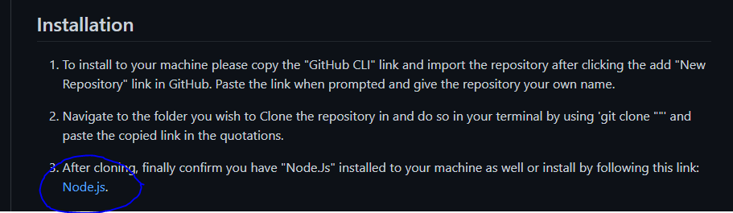

# teamProfileGenerator

## Description

This is a very simple and easy to use Team Profile Generator. With this you can enter the names and information of your 4 persons team. You can populte a Manager, Employee, Engineer and Intern using inquirer prompts and node.js. Please read the installation guide to assist with getting started. After installation is complete you are able to follow command line prompts to ultimately generate your unique HTML web page showing your new team!

## Table of Contents

* Walkthrough Video
* Sample HTML Page
* Installation
* Usage
* Contributions

## WalkThrough Video

Feel free to watch this video link to see this project in action: [video](https://drive.google.com/file/d/1VlwZc6psM4do73MYeN62OQGs_roCW5E-/view).

## Sample HTML Page

Here is a Screen Capture of the Sample HTML page generated via the walkthrough video using the project.

## Installation

1. To install to your machine please copy the "GitHub CLI" link and import the repository after clicking the add "New Repository" link in GitHub. Paste the link when prompted and give the repository your own name.

2. Navigate to the folder you wish to Clone the repository in and do so in your terminal by using 'git clone ""' and paste the copied link in the quotations.

3. After cloning, finally confirm you have "Node.Js" installed to your machine as well or install by following this link: [Node.js](https://nodejs.org/en/download/).

## Usage 

Please see below some helpful screenshots to help you with installation:

1. 

2. 

3. 

4. 

5. 

Type: node index to your terminal to begin the prompts to create your unique Team Profile. Once you've answered all the prompts you will receive a success message and your completed file will be available in the "dis" folder for your immediate use!

## Contributions

Made with ❤️ by: [GitHub](http://github.com/jasmineakbari) http://github.com/jasmineakbari

If you would like to contribute to this work please feel free to submit any push/pull request, create issues or reach out to me at my email: jasmineakbari@yahoo.com.